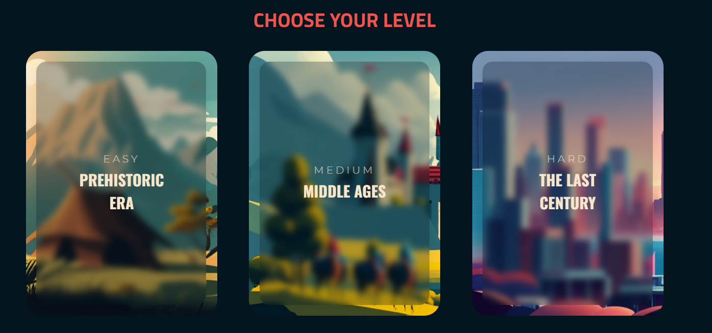

# Memory Challenge - Remember Us

## Overview

Memory Challenge - Remember Us is an interactive web-based memory card game designed to help players rescue humanity's knowledge and heritage from the devastating amnesia virus. The game offers three levels of difficulty: Easy, Medium, and Hard, each corresponding to different eras in human history.

## Features

- Three levels of difficulty: Easy, Medium, and Hard, each with its own set of cards representing abilities and discoveries made in the given era.
- Stunning visuals and thematic design that immerse players in the game's narrative.
- A timer to add an element of excitement and challenge to the gameplay.
- Modal pop-ups to indicate both victory and defeat, allowing players to try again or return to the level selection.

## How to Play

1. **Installation**: No installation is required

2. **Running the Game**:
   - Open the index.html webpage in your web browser
   - Start playing by matching pairs of cards representing different eras and inventions.

3. **Objective**: Match all the pairs of cards to complete the level before the virus erases the memories completely (1min) and save humanity's knowledge.

4. **Controls**:
   - Click on a card to reveal its content.
   - Match pairs of cards from different eras to progress.

## Dependencies

- This project uses Font Awesome icons for some visual elements.
- Web fonts from Google Fonts are used for text styling.

## Contributing

Contributions to the project are welcome. If you have any suggestions, bug reports, or feature requests, please open an issue on the GitHub repository.

Remember Us - © 2023, Your Name
